# PRÀCTICA

Exercici 1: la càrrega de dades a QGIS
======================================

La càrrega dels diferents conjunts de dades, és un pas essencial i indispensable en qualsevol projecte de QGIS, sigui de la naturalesa que sigui. És un procés amb el que hauràs de familiaritzar-te el més ràpidament possible. Per a poder visualitzar, editar, analitzar i representar cartogràficament les teves dades, cal en primer lloc incorporar-les al teu entorn de treball que, per al cas que t'ocupa, es tracta de QGIS.

El pas a pas
------------

El primer pas a realitzar, en iniciar un nou projecte de QGIS, és configurar-lo adequadament tot indicant quin serà el sistema de referència de coordenades, així com el nom i la ubicació d'on es guardarà el fitxer de projecte. 

A continuació, és necessari incorporar al projecte, totes les capes necessaries: vector, raster, fitxers de text o serveis web de mapes.

Els passos a seguir en cada cas, pots consultar-los en els vídeos següents:

- [Càrrega de dades vectorials - Part 1](https://www.loom.com/share/b9c4fcc806cc48be98990e8d6aace5b3)
- [Càrrega de dades vectorials - Part 2](https://www.loom.com/share/ee0938865f964b96b010dd04a02944a5)
- [Càrrega de dades raster](https://www.loom.com/share/b6af9a54e0164ebb86eedc182ff944f5)
- [Càrrega de serveis de mapes web](https://www.loom.com/share/5f80daef73a8429ca0ff392825eb8b78)
- [Instal·lació del complement ICGC](https://www.loom.com/share/b0263aa738fc479897653eee0349d112)
- [Instal·lació del complement QuickMapServices](https://www.loom.com/share/7b58d39003f5487881f896ce4ce0c8e6)
- [Geocodificació d'entitats per coordenades](https://www.loom.com/share/de1df88da8f64cb08de4399df697433f)

El teu torn
===========

Objectiu
--------

En aquest primer exercici, practicaràs amb la càrrega de dades de dades en format vectorial i raster, la càrrega de serveis de mapes web que sempre resulten de gran utilitat com a cartografia o mapes de base per qualsevol projecte, així com la geocodificació d'arxius de text ( .txt, .csv) per a la generació de noves capes de punts, a partir d'una sèrie de parells de coordenades.

Per finalitzar l'exercici, un cop carregades totes les capes a QGIS, hauràs de guardar aquesta configuració com un nou projecte (.qgs, .qgz). En tancar el programa i obrir-lo de nou, tot indicant que es vol obrir el projecte anteriorment desat, aquest s'haurà de restaurar completament, carregant i mostrant de forma automàtica les capes que estaven presents al panell de capes en el moment de guardar-lo.

Mètode
======

Has de seguir els passos indicats a l'apartat **El pas a pas**.

Material
========

Disposes de l'arxiu [carrega_de_dades.zip](https://drive.google.com/file/d/10fTtL8bhwXuAVC34IQSZeA_E6xtvrqCr/view?usp=share_link) que conté les següents capes per carregar al teu projecte de QGIS:

- Una capa vectorial en format GeoJSON.
- Una capa raster en format TIF.
- Una capa vectorial emmagatzemada en un fitxer GeoPackage.
- Un fitxer de text en format CSV per geocodificar.

A més de les capes que s'acaben d'esmentar, també hauràs de carregar els WMS corresponents al mapa topogràfic 1:5.000 i l'ortofotomapa 1:2.5000 de l'ICGC.

Ja per finalitzar, un cop carregades totes les capes al panell de capes, cal que les organitzis en dos grups: els WMS en un grup de capes anomenat **CARTOGRAFIA DE BASE** i, la resta de capes, en un grup anomenat **CAPES DE TREBALL**.

Finalment, desa el projecte, tanca QGIS, i obre'l de nou tot carregant el projecte desat. Es restaura completament i correctament?

----

Exercici 2: simbolització d'entitats vectorials
===============================================

El pas a pas
------------

En primer lloc, caldrà carregar una cartografia base per situar-te al territori. Per fer-ho, carregaràs un WMS, per exemple, l'estàndard d'OSM. Per a dur a terme aquesta tasca, caldrà que facis ús del complement **QuickMapServices**.

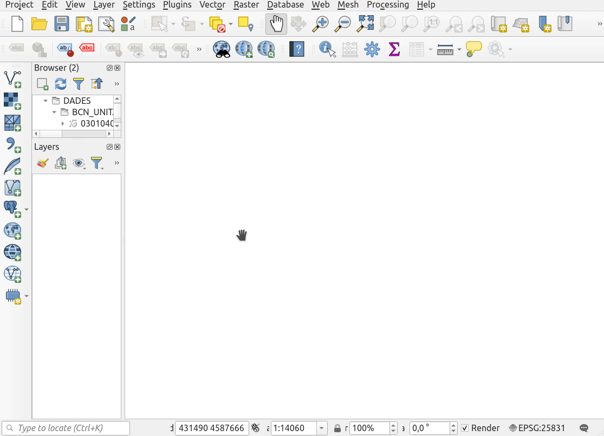

Carrega les capes **establiments_airbnb** i **airbnb_municipis** del fitxer [exercici_2.gpkg](https://drive.google.com/file/d/1ZN3IxYW3lcpDQUCNnqZs6S8Gd-E7a18X/view?usp=share_link)

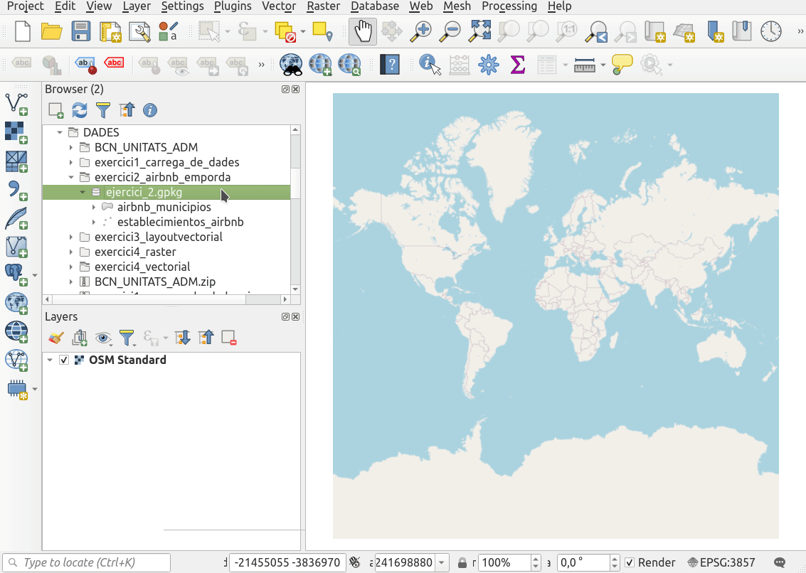

La capa de polígons **airbnb_municipis** conté els municipis de la comarca de l'Alt Empodrà amb les dades relatives al nombre d'establiments d'Airbnb que hi ha a cada municipi. Aquestes dades es recullen al camp **[NUMPOINT]** de la seva taula d'atributs. En aquest camp, només s'especifica el volumn d'oferta que hi ha d'Airbnb per a l'any 2018, però no se'n concreta la tipologia d'establiment.

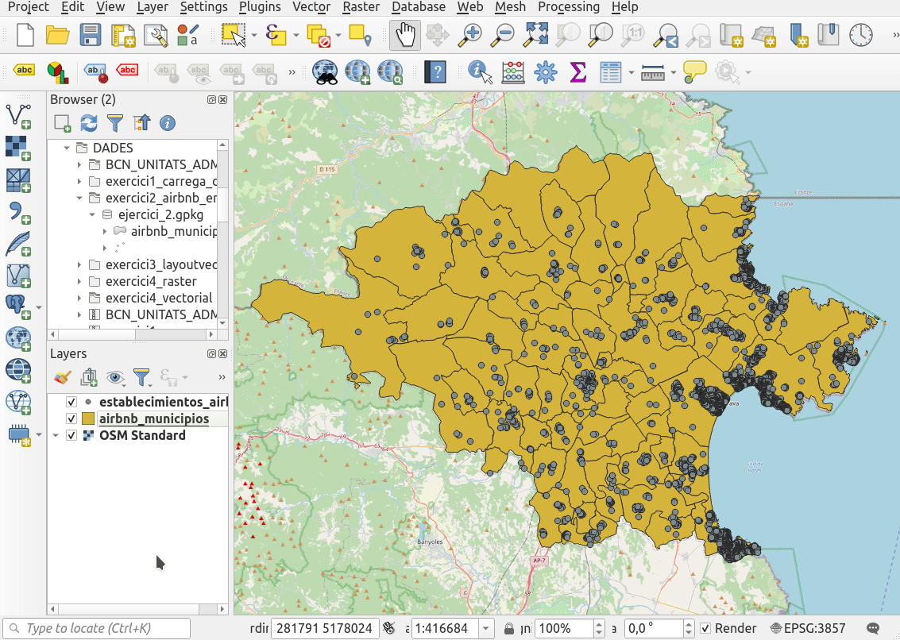

Com pots veure, l’Escala és un dels municipis amb més establiments turístics anunciats a la plataforma Airbnb. Aquesta capa d'informació permet classificar de manera gradual els municipis en funció de la seva quantitat d'oferta turística. D'aquesta manera, veuràs a simple vista quins municipis són més turístics i quins ho són menys.

Per això, cal que accedeixis a l'apartat de simbolització de la capa, bé a través de les propietats de la pròpia capa (*botó dret a la capa > Properties… > Symbology*), bé prement la tecla **F7**. La simbolització de la capa et permetrà obtenir un resultat similar al que es mostra a continuació:

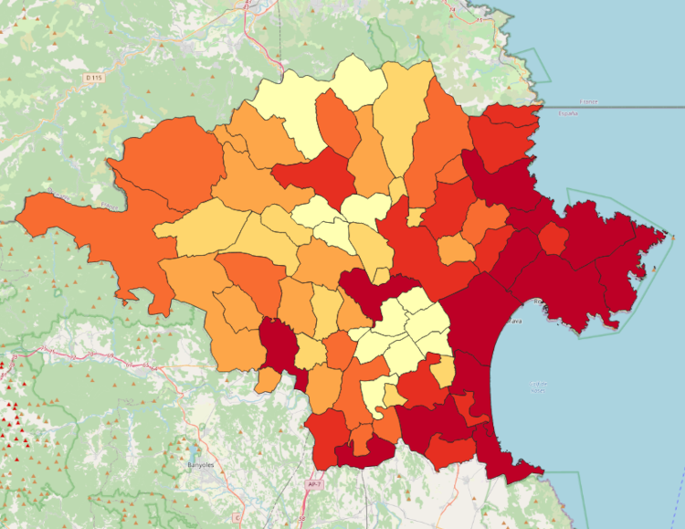

Si tens dificultats per generar el mapa de coropletes mostrat anteriorment, segueix les instruccions de la següent imatge animada per generar la teva pròpia paleta de colors.

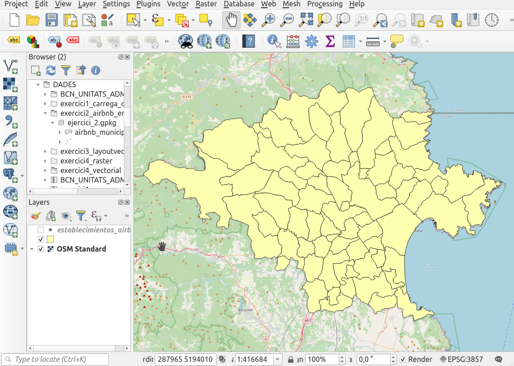

A més, les eines de simbolització de QGIS, permeten aplicar efectes a la teva cartografia perquè aquesta tingui un millor acabat des del punt de vista estètic:

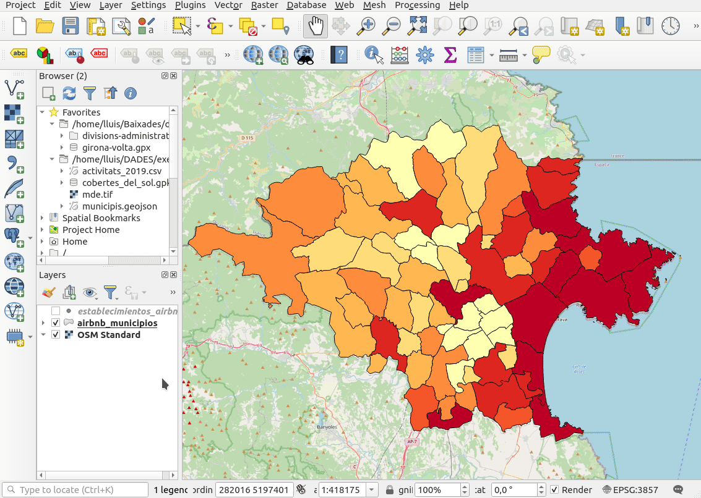

Un cop simbolitzats els municipis per tal que representin l'oferta turística d'Airbnb a la comarca, caldrà que simbolitzis el tipus d'establiment en cada cas.

Els detalls sobre la tipologia d'establiments d'Airbnb i les seves característiques, es recullen a la capa de punts **establiments_airbnb**. Si obres la taula d'atributs veuràs que els camps **[room_type]**, **[bedroom]** i **[capacity]** informen sobre les característiques de cada punt.

Amb aquesta capa, podràs representar cada punt segons el tipus d'habitació (categoritzant a través de la simbologia):

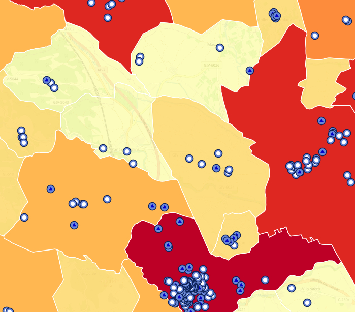

O bé podràs indicar amb la mida de cada punt, la capacitat o el preu, de cada establiment (graduant la simbologia):

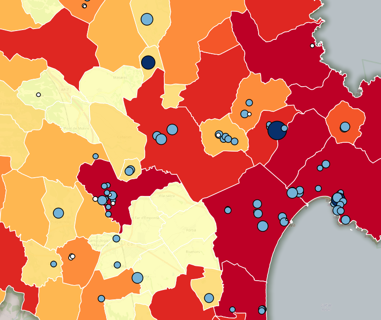

Ara prova d'aplicar una simbologia semblant a la teva capa de punts. Quin resultat has obtingut? Les següents indicacions et seran útils si no aconsegueixes uns resultats satisfactoris.

Representació segons tipus d'establiment:

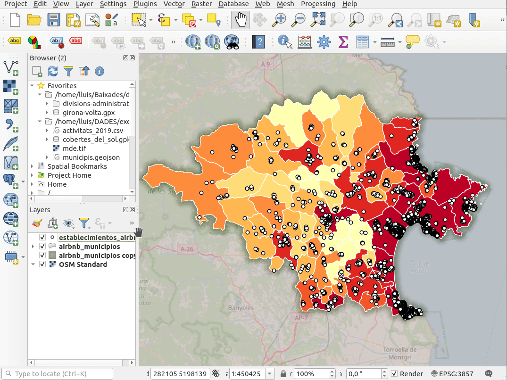

Representació segons el preu de l'allotjament:

Un cop hagis representat les dades a la teva conveniència, és moment d'afegir algunes etiquetes que poden ajudar el lector a ubicar-se al territori. Hi afegiràs els noms dels municipis tal com es mostra a la imatge següent:

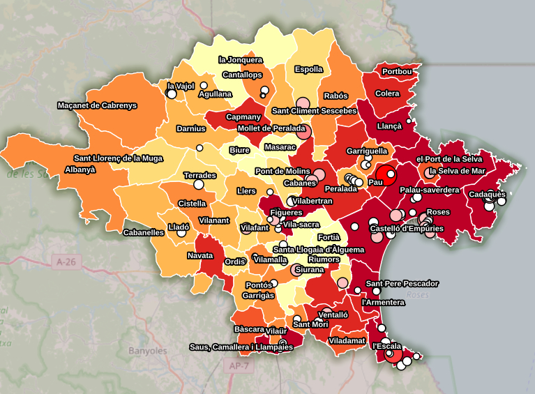

A continuació, es detalla com fer-ho:

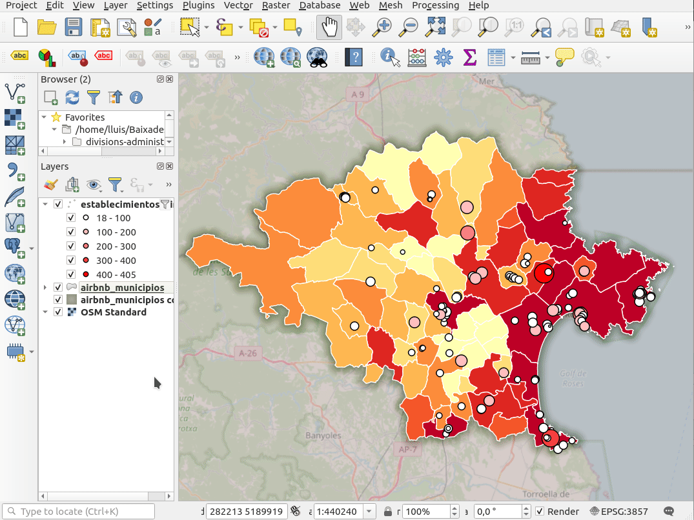

----
